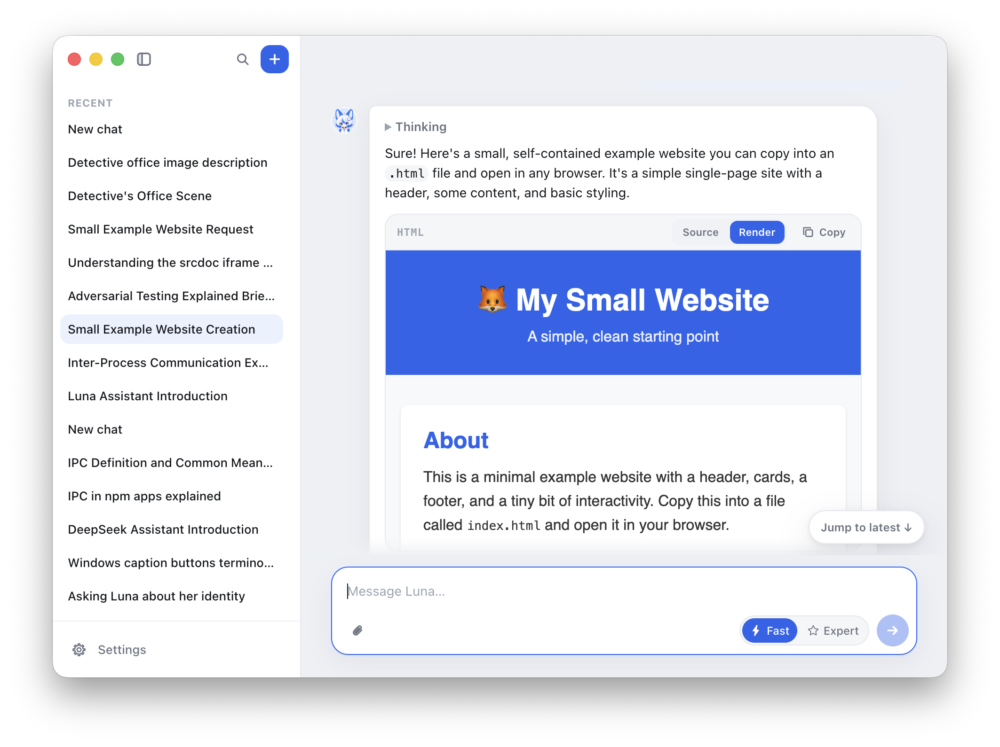
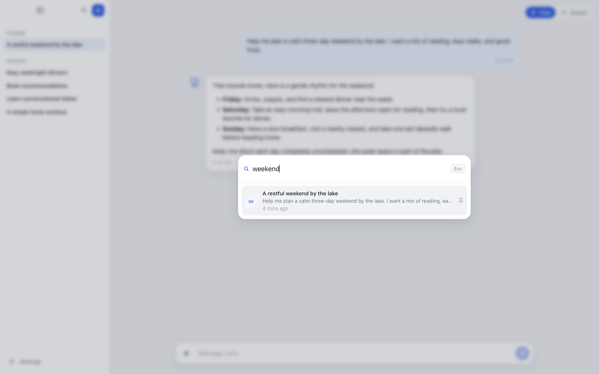

<p align="center">
  
</p>

<h1 align="center">Luna</h1>

<p align="center">
  A desktop chat client for OpenAI-compatible AI models, for macOS and Windows.
</p>

## What Luna is

Luna is an application you install on your own computer. You use it to have text conversations
with an AI model.

Luna does not include an AI model, a hosted service, or API credits. You supply your own
provider. A provider is any server that implements one of the two OpenAI-compatible APIs listed
below. Examples include OpenAI itself, and local servers such as LM Studio, Ollama, or
llama.cpp.

Luna stores every conversation on your computer only. Luna sends your messages to the provider
you configured, and to nowhere else.

## Screenshots





## What Luna can do

- Connect to providers that implement the **OpenAI Responses API** or the **OpenAI Chat
  Completions API**.
- Assign two models at once. **Fast** is for everyday questions. **Expert** is for harder
  questions. You switch between them per conversation.
- Show replies as they arrive, one piece at a time, instead of waiting for the whole reply.
- Render Markdown, code blocks, and links in replies.
- Render HTML that a model produces, inside an isolated preview frame. You choose when to render
  it. It is never rendered automatically.
- Show a model's reasoning, when the model provides it, in a section you can collapse.
- Attach images, PDFs, and plain-text files to a message.
- Search your conversations by title and by message text.
- Store API keys in the operating system's encrypted storage: Keychain on macOS, DPAPI on
  Windows.
- Export one conversation, or all conversations, to JSON files.
- Delete everything Luna has stored, in one action.

Luna has four themes: Luna Light, Luna Dark, Gruvbox Light, and Gruvbox Dark. Luna Light is the
default.

## Install

Download the file for your operating system from the
[latest release](https://github.com/cavecomputing/luna/releases/latest).

| Operating system            | File to download                | How to install                                    |
| --------------------------- | ------------------------------- | ------------------------------------------------- |
| macOS, Apple silicon (M1–M4) | `Luna-<version>-arm64.dmg`      | Open the file, then drag Luna into Applications.   |
| macOS, Intel                | `Luna-<version>-x64.dmg`        | Open the file, then drag Luna into Applications.   |
| Windows 10 or 11, 64-bit    | `Luna-Setup-<version>-x64.exe`  | Run the file and follow the installer.             |

To find out which Mac you have, open the Apple menu and choose **About This Mac**. If the Chip
line contains the word "Apple", download the `arm64` file. If it contains the word "Intel",
download the `x64` file.

### These builds are not code-signed

Luna's release files are not signed with an Apple or Microsoft code-signing certificate. Your
operating system will warn you the first time you open Luna. This is expected. The steps below
tell the operating system to allow this specific application.

**On macOS**, you will see a message saying Luna "cannot be opened because the developer cannot
be verified", or that Luna "is damaged". To open Luna anyway:

1. Move Luna into your Applications folder, if you have not already.
2. Open **System Settings**, then **Privacy & Security**.
3. Scroll down to the **Security** section.
4. Find the message about Luna being blocked, and select **Open Anyway**.
5. Enter your password when macOS asks for it.

You only need to do this once.

**On Windows**, you will see a blue box titled "Windows protected your PC". To install Luna
anyway:

1. Select **More info**.
2. Select **Run anyway**.

You only need to do this once.

## First-time setup

Luna cannot send a message until you tell it which provider and which model to use. Do this
first:

1. Start Luna.
2. Open Settings. Press `Cmd+,` on macOS, or `Ctrl+,` on Windows.
3. Go to the **Providers** section. Luna comes with one entry named OpenAI, already pointing at
   `https://api.openai.com/v1`. Edit that entry, or select **Add provider** to create a
   different one.
4. Enter your API key in the **API key** field. Leave this field empty if your provider is a
   local server that does not require a key.
5. Select **Save & test**. Luna contacts the provider and reports whether the connection
   worked. If it worked, Luna also downloads the list of models the provider offers.
6. Go to the **Models** section.
7. For the **Fast** slot, choose a provider, then choose a model. You can pick a model from the
   list, or type a model ID yourself.
8. Repeat step 7 for the **Expert** slot. Both slots may use the same provider and the same
   model.
9. Close Settings.

You can now start a conversation. Select the **+** button at the top of the sidebar, type your
message, and press Enter.

For a longer explanation of each setting, read [Getting started](docs/getting-started.md).

## Keyboard shortcuts

These shortcuts work in Luna's main window. On macOS use `Cmd`. On Windows use `Ctrl`.

| Action                      | Shortcut       |
| --------------------------- | -------------- |
| New conversation            | `Cmd/Ctrl+N`   |
| Command palette             | `Cmd/Ctrl+P`   |
| Search conversations        | `Cmd/Ctrl+F`   |
| Show or hide the sidebar    | `Cmd/Ctrl+B`   |
| Switch Fast and Expert mode | `Cmd/Ctrl+Shift+M` |
| Open Settings               | `Cmd/Ctrl+,`   |
| Show all keyboard shortcuts | `Cmd/Ctrl+?`   |
| Send the message            | `Enter`        |
| Start a new line            | `Shift+Enter`  |
| Close a dialog              | `Esc`          |

## Where Luna stores your data

Luna keeps all of your data in one folder on your computer:

- **macOS:** `~/Library/Application Support/Luna`
- **Windows:** `%APPDATA%\Luna`

That folder contains `luna.db`, a SQLite database holding your conversations, messages,
attachments, preferences, and provider settings. It also contains a `backups` folder with up to
five recent copies of that database.

Your API keys are **not** stored in that database. They are encrypted by the operating system
and stored separately, in a `provider-keys` folder inside the same directory.

To remove everything Luna has stored, open Settings, go to **Privacy**, and use **Delete all
data**. Luna asks you to confirm twice before deleting anything.

## Build from source

You do not need to do this to use Luna. These steps are for people who want to modify Luna or
build it themselves.

Install [Node.js version 22 or newer](https://nodejs.org/), then run:

```bash
git clone https://github.com/cavecomputing/luna.git
```

```bash
cd luna && npm install && npm run dev
```

On Windows PowerShell, use `npm.cmd` instead of `npm` if PowerShell blocks the `npm.ps1` script.

See [Development](docs/development.md) for the full contributor workflow.

## Documentation

- [Getting started](docs/getting-started.md) — installing, configuring a provider, daily use.
- [Development](docs/development.md) — building, testing, and packaging Luna.
- [Architecture](docs/architecture.md) — how Luna is built internally.
- [Roadmap](docs/roadmap.md) — what is planned after 1.0.
- [Windows](docs/windows.md) — Windows-specific setup and packaging.
- [CLAUDE.md](CLAUDE.md) — the project's engineering, security, and privacy contract.

## License

Apache License 2.0. See [LICENSE](LICENSE).
